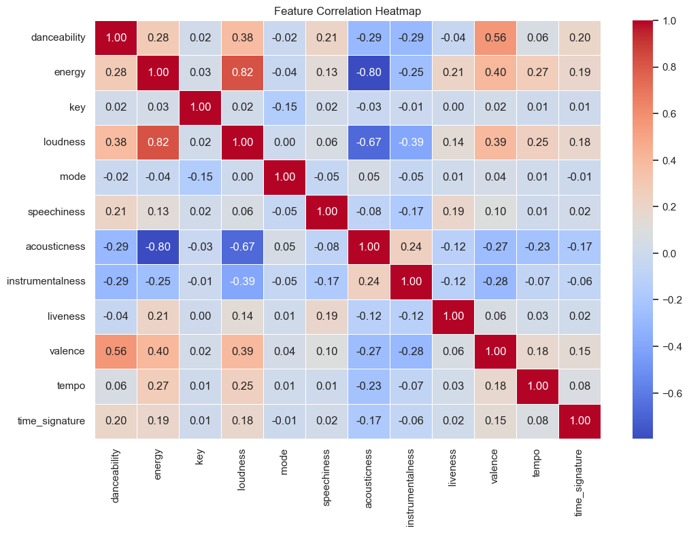
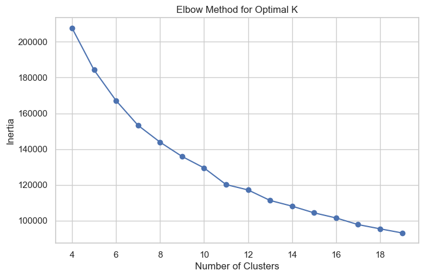
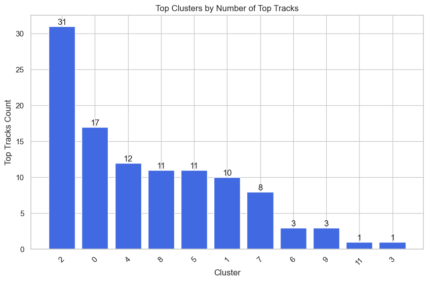

# Business Understanding
Music streaming platforms offer vast libraries, making it challenging for users to discover new songs aligned with their tastes. This project aims to create a personalized recommendation system that blends familiar favorites with new discoveries, helping users curate playlists tailored to their listening habits. The system clusters songs based on their audio characteristics, allowing for better organization and improved music recommendations.

# Data Understanding
1. Extracting My Top 2000 Songs
* Using Spotify's API and the Spotipy library, I retrieved my top 2000 most-listened-to songs.
* See **[this notebook](https://github.com/hannahdallas/spotify_playlist_recommender/blob/main/creating_spotify_dataset.ipynb)** for more details.

2. 1.2M Spotify Songs Kaggle Dataset
* The dataset used in this project is sourced from **[Kaggle - Spotify 12M Songs](https://www.kaggle.com/datasets/rodolfofigueroa/spotify-12m-songs)**. 
* Contains audio features for over 1.2 million songs, obtained with the Spotify API.

3. Final Dataset: "songs.csv"
* 1,204,025 rows and 25 columns
* To integrate my top songs into this dataset, I added a binary column (in_top_tracks) indicating whether each song in the Kaggle dataset was part of my top 2000 songs.

## Feature Selection
The features included were chosen based on their relevance to audio perception and mood classification. Key attributes include:
* Danceability, Energy, and Valence: To assess the overall feel of a song.
* Tempo and Loudness: To capture intensity and dynamics.
* Speechiness and Instrumentalness: To distinguish between lyrical and instrumental music.

## Data Preparation
1. Merged the Kaggle dataset with the user's top tracks from Spotify.
2. Dropped unnecessary columns such as track number, disc number, and release year. Also dropped energy as it was correlated with other fields.

3. Scaled numerical features to standardize data for clustering.
4. Handled missing values and outliers to improve model performance.

# Exploratory Data Analysis
* Analyzed distributions of key audio features across the dataset.
* Visualized clusters to understand how songs are grouped based on characteristics.
* Examined correlations between features to determine their influence on clustering.

# Modeling and Evaluation
* Applied K-Means, Agglomerative Clustering, DBSCAN and Gaussian Mixture Models (GMM) to segment songs.
* Used Silhouette Score and Cosine Similarity to assess clustering quality.
* Reduced dimensionality with PCA to improve cluster separation and visualization.

# Conclusion
* Ultimately we chose the PCA Kmeans model using 12 clusters which gave us a cosine score of 0.8248 and silhouette score of 0.2049.
* Then we took the top 3 clusters containg songs in top tracks and used the songs in those clusters to create playlists in spotify.

* The project successfully grouped songs into distinct clusters, allowing users to receive personalized playlist recommendations. By leveraging audio features and clustering techniques, the system provides a structured way to explore new music while preserving individual listening preferences.

## Limitations
1. The model does not incorporate collaborative filtering, limiting recommendations to content-based approaches.
2. Cluster labels are not predefined, requiring interpretation based on feature analysis.
3. Songs from underrepresented genres may not cluster effectively.

## Recommendations
1. Introduce a rating system to refine song recommendations based on user feedback.
2. Incorporate collaborative filtering to enhance recommendations with social listening patterns.
3. Fine-tune clustering parameters to improve accuracy in capturing user preferences.
4. Experiment with hybrid models combining content-based and collaborative filtering approaches.

# Links
More details on the analysis can be found [here](https://github.com/hannahdallas/spotify_playlist_recommender/blob/main/notebook.ipynb).

The presentation can be found [here](https://docs.google.com/presentation/d/1e4T3LrZ9oDL0o0EhGJFBoq1SUpFOpg2ve2_JNTJhEV8/edit?usp=sharing).

## Repository Structure

- 📂 **images/** - Folder for images used in reports and documentation  
- 📂 **data/** - Contains datasets (CSV, JSON, etc.)  
- 📄 **README.md** - Project documentation and overview  
- 📄 **presentation.pdf** - Final presentation slides  
- 📓 **create_new_spotify_playlists.ipynb** - Notebook for generating Spotify playlists  
- 📓 **creating_spotify_dataset.ipynb** - Notebook for collecting top tracks from Spotify  
- 📓 **notebook.ipynb** - Main notebook for data analysis and model development  
